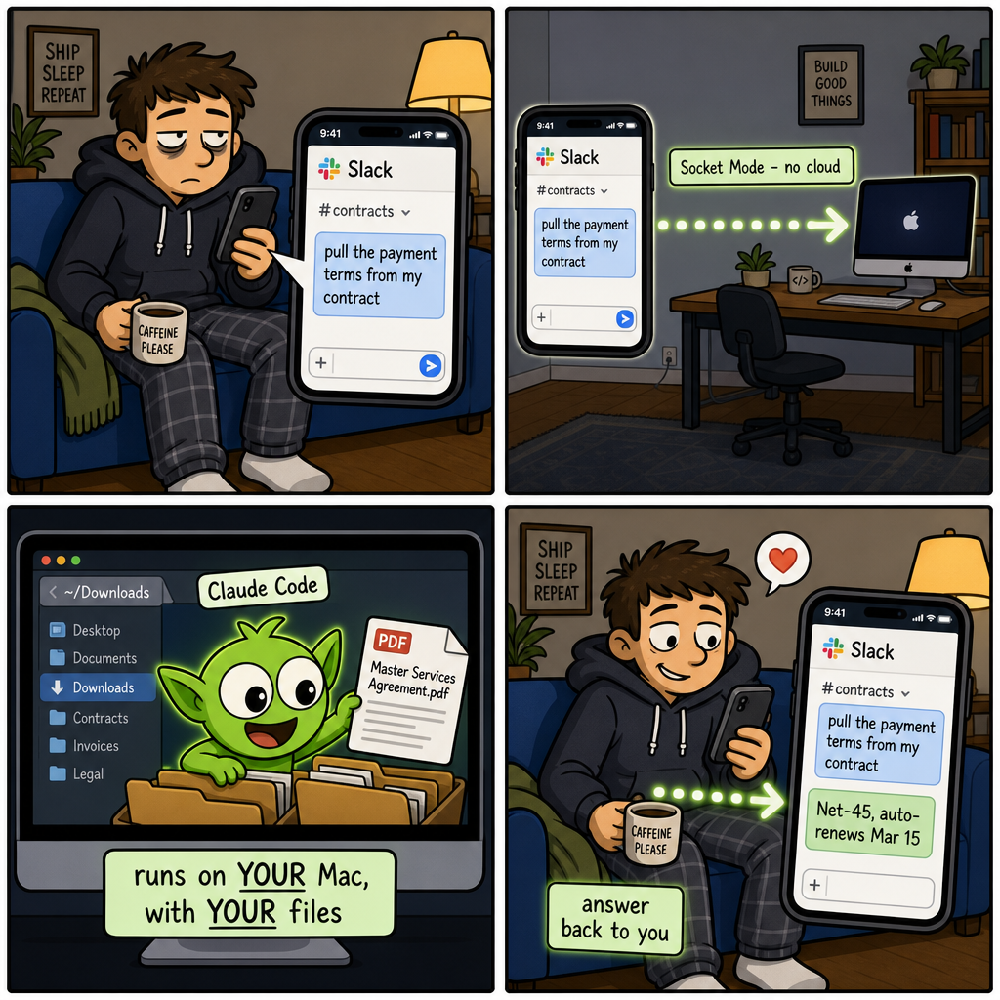
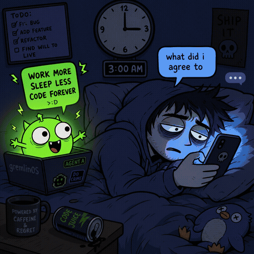

# claude-slack-daemon

**Reach your own Claude Code from a Slack DM. Your machine, your tools, your memory — no cloud brain, no webhook, no public endpoint.**

<p align="center">
  
</p>

<p align="center"><em>Text Slack from the couch. Your Mac does the work — with your files, your tools, your memory.</em></p>

Text yourself an idea, a link, or a question in Slack; a tiny daemon on your Mac spawns **headless Claude Code** to handle it with full access to your local files, shell, and MCP tools — then replies in the same DM. Every conversation keeps its memory.

> Most "Claude in Slack" integrations call a **cloud** API that can't touch your computer. This is the inverse: **Slack is just the remote control; the brain is the real Claude Code already on your machine** — with your skills, your MCP servers, your files.

---

## Why this exists

| | Cloud-LLM Slack bots | **claude-slack-daemon** |
|---|---|---|
| Engine | a hosted API | **your local Claude Code** |
| Reaches your files / shell / MCP | ❌ | ✅ |
| Transport | webhook (needs a public URL/tunnel) | **Socket Mode** (outbound only, no inbound port) |
| Memory | varies | **persistent per-thread** via `--resume` |
| Who can talk to it | varies | **single-owner allowlist** (default-deny) |
| Auth / cost | a separate API key | **your existing Claude Code login/subscription** |

## How it works

```
You DM the bot in Slack
   │   Socket Mode  (an outbound WebSocket your Mac holds open — no inbound port, no tunnel)
   ▼
claude-slack-daemon   (slack_bolt · ~15 MB idle · launchd-managed)
   │   spawns:  claude -p --resume <session> --output-format json
   ▼
Claude Code on your machine  →  your files · shell · MCP servers · skills
   │   reply
   ▼
Back into your Slack DM
```

- **Socket Mode** → no tunnel, no public URL, no inbound firewall hole.
- **`--resume` per thread** → each DM is one long-lived conversation with memory; it survives daemon restarts (session IDs persist to disk).
- **launchd + heartbeat watchdog** → self-healing: if it ever dies, it restarts within minutes and pings you.
- **Default-deny allowlist** → only the Slack user IDs you list are answered. Everyone else is silently ignored.

## Features

- 🧠 **Persistent memory** per conversation (`--resume`, one session per Slack thread)
- 🔒 **Single-owner isolation** — default-deny allowlist, enforced before any work
- 🖥️ **Full local capability** — files, shell, your MCP servers, your Claude Code skills
- 🔌 **No public endpoint** — Socket Mode only
- ♻️ **Self-healing** — launchd KeepAlive + an independent heartbeat watchdog
- 💸 **No separate API key** — uses your existing Claude Code login/subscription
- ⚡ **Instant ack** — replies `…` immediately, then edits in the answer when ready

**Optional, opt-in ([v0.2](CHANGELOG.md) — all off by default):**

- 🏗️ **Background jobs** — text a big multi-step job from your phone; it runs detached and pings you `done`. `tasks` / `show #N` / `stop #N`.
- 📬 **Proactive digest** — periodically scans your unread Gmail + Slack @-mentions, Claude triages, you get one short DM of what actually needs you (read-only).
- 💡 **Draft assistant** — when someone @-mentions you, it drafts a reply (full-thread aware) into your DM. It never sends — you review and hit send.

## Requirements

- **macOS** (launchd). Linux/systemd is planned.
- **[Claude Code CLI](https://code.claude.com)** installed and logged in — verify with `claude --version`.
- **Python 3.11+**.
- A Slack workspace where you can create an app.

## Install

### 1 — Create the Slack app (one paste)

Open **[api.slack.com/apps](https://api.slack.com/apps) → Create New App → From a manifest**, pick your workspace, paste [`slack-app-manifest.yaml`](slack-app-manifest.yaml), and **Create**. The manifest pre-enables Socket Mode, the message tab, and the exact scopes — so you skip all the manual toggling.

### 2 — Get two tokens

- **App-Level Token** (`xapp-`): *Basic Information → App-Level Tokens → Generate*, add scope `connections:write`.
- **Bot Token** (`xoxb-`): *Install App → Install to Workspace*, then copy the **Bot User OAuth Token**.

### 3 — Configure

```bash
git clone <your-fork> claude-slack-daemon && cd claude-slack-daemon
python3 -m venv venv && ./venv/bin/pip install -r requirements.txt

cp .env.example .env                  # paste your xapp- and xoxb- tokens
cp config.example.toml config.toml    # set name / owner / reply_language
```

### 4 — Allow yourself (default-deny)

DM your new bot once, then read the log to find your Slack user ID:

```bash
./venv/bin/python agent.py            # run in the foreground for now
# in another shell:
grep 'IN ' ~/.claude-slack-daemon/agent.log   # → shows the channel; user id is logged on ignore
```

Add your `U...` id to `allowed_user_ids` in `config.toml`. Until you do, the bot answers **no one** (that's the safe default).

### 5 — Keep it running

Quick start (foreground): `./venv/bin/python agent.py`

To run it forever (auto-restart on crash/reboot), use launchd — save this as
`~/Library/LaunchAgents/com.you.claude-slack-daemon.plist` (edit the three paths), then
`launchctl load ~/Library/LaunchAgents/com.you.claude-slack-daemon.plist`:

```xml
<?xml version="1.0" encoding="UTF-8"?>
<!DOCTYPE plist PUBLIC "-//Apple//DTD PLIST 1.0//EN" "http://www.apple.com/DTDs/PropertyList-1.0.dtd">
<plist version="1.0"><dict>
  <key>Label</key><string>com.you.claude-slack-daemon</string>
  <key>ProgramArguments</key><array>
    <string>/ABSOLUTE/PATH/claude-slack-daemon/venv/bin/python</string>
    <string>/ABSOLUTE/PATH/claude-slack-daemon/agent.py</string>
  </array>
  <key>WorkingDirectory</key><string>/ABSOLUTE/PATH/claude-slack-daemon</string>
  <key>RunAtLoad</key><true/>
  <key>KeepAlive</key><true/>
</dict></plist>
```

Then DM the bot from your phone or desktop. That's it.

## Configuration

Everything deployment-specific is in [`config.example.toml`](config.example.toml). Highlights:

| Key | What |
|---|---|
| `bot.name` / `bot.owner` | how the agent identifies itself / refers to you |
| `bot.reply_language` | `"English"`, `"中文"`, or `"the same language the user writes in"` |
| `access.allowed_user_ids` | **default-deny** — only these Slack IDs are answered |
| `agent.model` | `sonnet` \| `opus` |
| `agent.mcp_config` | path to **your own** `.mcp.json` → gives the bot your MCP tools |
| `agent.permission_mode` | `default` \| `acceptEdits` \| `bypassPermissions` (see Security) |
| `agent.dispatch_big_jobs` | offload big jobs to a background runner (see below) |
| `[digest]` / `[draft]` | the optional proactive features (see below) |

## Proactive mode & background jobs (v0.2)

Three opt-in extras turn the daemon from "answers when asked" into "reaches out when it matters." All are **off by default**; enable them in `config.toml`.

### 🏗️ Background jobs — `tasks.py`

Set `agent.dispatch_big_jobs = true`. Now when you text a big, multi-step request, the bot doesn't block on one reply — it offloads the job to a **detached background runner** and pings your DM when it's `done` (or `failed`). You get three DM commands:

| Command | Does |
|---|---|
| `tasks` | list the recent queue |
| `show #N` | the full request + result of job N |
| `stop #N` | cancel a running job |

It's headless by default (no terminal window to babysit), so it works over SSH too. Tune `[tasks].timeout_seconds`; unattended jobs may want a more permissive `[tasks].permission_mode`.

**Watch it live — `[tasks] mode = "window"` (macOS).** Prefer to *see* a big job run instead of getting a headless ping? Set `mode = "window"` and the runner pops a Terminal/iTerm window with Claude Code working the task interactively: watch every step, jump in whenever, and the session stays open — just keep typing to continue when you're back at your desk. Uses iTerm if installed, else the built-in Terminal.app; closing the session pings your DM. (On first run in a new working dir, Claude Code asks once to trust the folder — accept it.)

### 📬 Proactive digest — `digest.py`  ·  💡 Draft assistant — `draft.py`

Both are **standalone scripts you run on a timer** (they aren't part of the always-on daemon). Both are **read-only / never-send**:

- **`digest.py`** scans your unread Gmail + Slack @-mentions, lets Claude pick what genuinely needs you, and pushes one short DM. Enable `[digest].enabled = true`.
- **`draft.py`** drafts a reply to your latest Slack @-mention (reading the whole thread) into your DM. You review and send it yourself. Enable `[draft].enabled = true`.

Both need a **User OAuth Token** (`SLACK_USER_TOKEN` in `.env`, scope `search:read` + history — the manifest already requests it). Set `bot.slack_handle` (your @handle) and, optionally, `bot.owner_context` (a one-liner about you, so the triage knows what matters). The digest's Gmail half also needs `GMAIL_ADDRESS` + `GMAIL_APP_PASSWORD`.

Run them on macOS launchd `StartInterval` (or cron) — e.g. digest every 30 min, draft every ~2.5 min for near-real-time:

```xml
<!-- ~/Library/LaunchAgents/com.you.claude-slack-digest.plist  (edit the paths) -->
<?xml version="1.0" encoding="UTF-8"?>
<!DOCTYPE plist PUBLIC "-//Apple//DTD PLIST 1.0//EN" "http://www.apple.com/DTDs/PropertyList-1.0.dtd">
<plist version="1.0"><dict>
  <key>Label</key><string>com.you.claude-slack-digest</string>
  <key>ProgramArguments</key><array>
    <string>/ABSOLUTE/PATH/claude-slack-daemon/venv/bin/python</string>
    <string>/ABSOLUTE/PATH/claude-slack-daemon/digest.py</string>
  </array>
  <key>WorkingDirectory</key><string>/ABSOLUTE/PATH/claude-slack-daemon</string>
  <key>StartInterval</key><integer>1800</integer>
</dict></plist>
```

Test either one immediately (bypassing the work-hours window) with:

```bash
CCSLACK_FORCE=1 ./venv/bin/python digest.py
CCSLACK_FORCE=1 ./venv/bin/python draft.py
```

## Security

This bot can read files and run shell commands **as you** on your machine. Keep it single-owner:

- **Allowlist is default-deny.** Empty `allowed_user_ids` = answers no one. Add only your own id.
- **Prefer `acceptEdits`** over `bypassPermissions`. Either way, your Claude Code `permissions.deny` rules (e.g. `.env`, `.ssh`) still apply.
- **Keep it single-owner.** This is a personal tool, not a shared workspace bot.

## How memory works

Each Slack thread maps to one Claude Code `session_id`, stored in `~/.claude-slack-daemon/sessions.json`. The first message mints a UUID (`--session-id`); every later message resumes it (`--resume`). Long conversations stay bounded via Claude Code's auto-compaction.

## …and yes, it has opinions about your 3 AM downloads

<p align="center">
  
</p>

## Changelog

See [CHANGELOG.md](CHANGELOG.md). Latest: **v0.2** — proactive digest, draft assistant, and background jobs (all opt-in).

## License

MIT — see [LICENSE](LICENSE).
